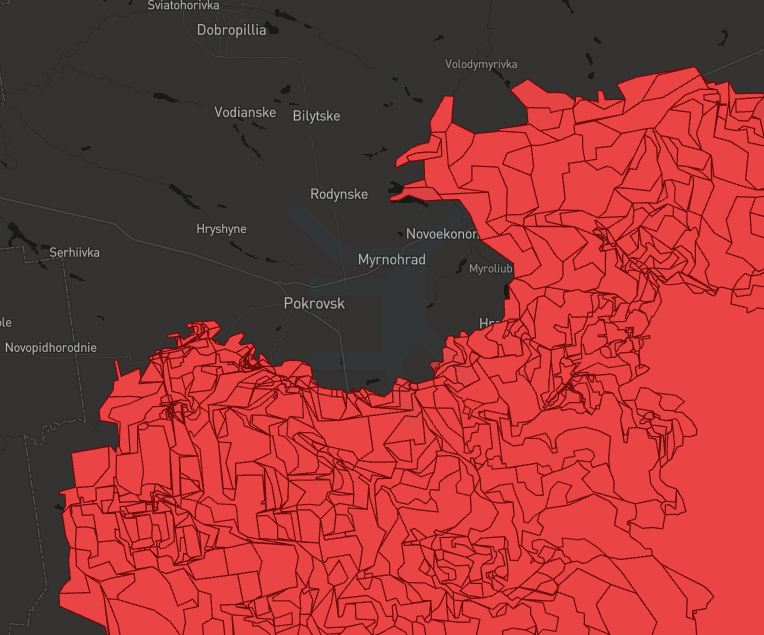

[](https://www.python.org/downloads/release/python-3124/)
[](https://github.com/cyterat/deepstate-map-data/actions/workflows/update.yml)

# 🔫 DeepState Map Data

Every GeoJSON, in `data` folder, contains up-to-date Multipolygon, representing the russian-occupied territory of Ukraine.

**Name format:**
`deepstatemap_data_<update_date>.geojson`

**Frequency of updates:**
Daily, at 03:00 UTC.

    To Do:
    - Write a simple script using notebook code. ✅
    - Set up Github Actions for daily updates. ✅
    - Create a single compressed GeoJSON consolidating all data so far. ✅
    - Write another script for Github Actions for daily updates of the above mentioned GeoJSON. ✅


## 📚 `deepstate-map-data.geojson.gz` -- Unified, Compressed Dataset

🟡 __Important:__ All files within the `data` folder remain untouched, and continue to be daily updated.

The new compressed file contains all historical geomtries alongside their respective update dates, currently stored in the `data` folder.

**Name format:**
`deepstate-map-data.geojson.gz`

**Frequency of updates:**
Daily, at around 03:00 UTC.

_Sample Data Structure:_

| id  | date       | geometry                                          |   |   |
|-----|------------|---------------------------------------------------|---|---|
| 0   | 2024-07-08 | MULTIPOLYGON (((35.20146 45.52334, 35.31126 45... |   |   |
| 1   | 2024-07-09 | MULTIPOLYGON (((35.20146 45.52334, 35.31126 45... |   |   |
| ... | ...        | ...                                               |   |   |

\* _`date` represents date of update._

### __Accessing compressed data__

If your application or tool does not support gzip-compressed GeoJSON files, below are several different ways I personally used to access/unzip the data.

__Python (if compressed)__

```
import geopandas as gpd
from io import StringIO
import gzip

with gzip.open("deepstate-map-data.geojson.gz", "rt", encoding="utf-8") as f:
    geojson_str = f.read()

gdf = gpd.read_file(StringIO(geojson_str))

print(gdf.head())
```

__Python (if uncompressed)__

```
import geopandas as gpd

file = "deepstate-map-data.geojson"
gdf = gpd.read_file(file)

print(gdf.head())
```

__Linux Terminal (unzip)__

```
gunzip -c deepstate-map-data.geojson.gz > deepstate-map-data.geojson
```

__Windows 7-Zip archiver (unzip)__

    1. Right-click `deepstate-map-data.geojson.gz`
    2. Select "Extract Here"
    3. The file will decompress to `deepstate-map-data.geojson`

### ⚠️ __Performance Warning__

 Since many features share locations and vary only slightly day to day, rendering all records at once (~400 as of 2025) using tools like __geojson.io__, can cause severe lag.

Try to filter `date` or use sample subsets before using less powerful rendering tools, if you experienced similar performance issues in the past.

_Below: example of multiple layers stacking when loading full dataset without filters_
<br>

### SQL & PostGIS Optimization (Performance Fix) / Оптимізація SQL та PostGIS

To address the performance warnings regarding rendering and processing large historical GeoJSON datasets, you can import this data into a spatial database like **PostgreSQL with PostGIS**. This offloads the heavy spatial processing from Python/Frontend straight to the database engine using spatial indexes.

Для вирішення проблем із продуктивністю під час обробки та рендерингу великих історичних наборів даних GeoJSON, ви можете імпортувати ці дані в просторову базу даних, таку як **PostgreSQL з PostGIS**. Це переносить важку просторову обробку з Python/Frontend безпосередньо на рушій бази даних за допомогою просторових індексів.

**Database Schema Setup / Налаштування схеми бази даних:**
```sql
-- Enable PostGIS extension for spatial data / Увімкнення розширення PostGIS для просторових даних
CREATE EXTENSION IF NOT EXISTS postgis;

-- Create table for historical occupied territories / Створення таблиці для історичних даних про окуповані території
CREATE TABLE deepstate_map_data (
    id SERIAL PRIMARY KEY,
    datum DATE NOT NULL,
    geometry GEOMETRY(MultiPolygon, 4326) NOT NULL
);

-- Spatial index to fix performance lag / Просторовий індекс для усунення затримок продуктивності
CREATE INDEX idx_deepstate_geometry ON deepstate_map_data USING gist(geometry);

-- B-Tree index for fast date filtering / Індекс B-Tree для швидкої фільтрації за датою
CREATE INDEX idx_deepstate_datum ON deepstate_map_data(datum);
```

**Fast Historical Changes Query Example / Приклад швидкого запиту історичних змін:**
```sql
-- Calculate the exact territory changes between two dates / Розрахунок точних змін території між двома датами
SELECT 
    ST_Difference(t2.geometry, t1.geometry) AS territory_change
FROM deepstate_map_data t1
JOIN deepstate_map_data t2 ON t1.datum = '2026-10-09' AND t2.datum = '2026-10-10';
```
